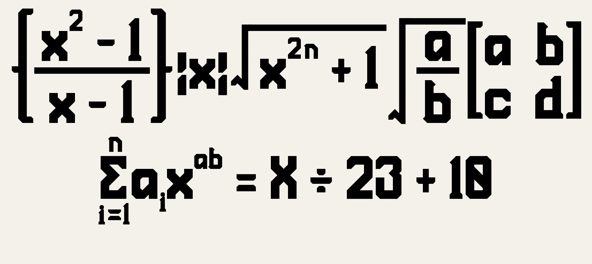
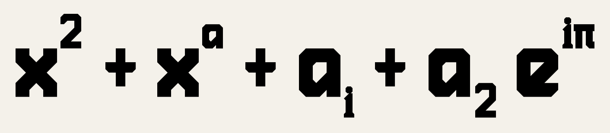
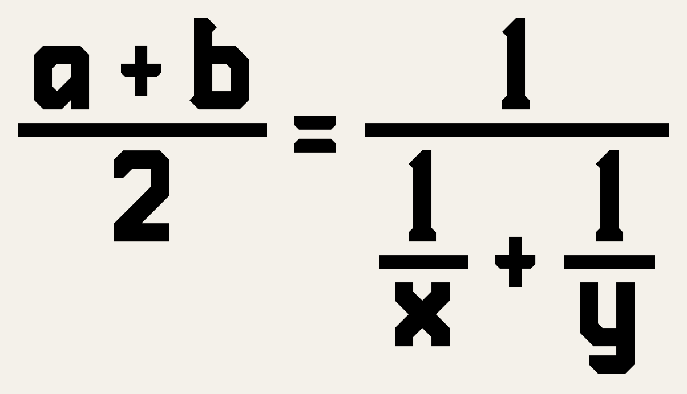
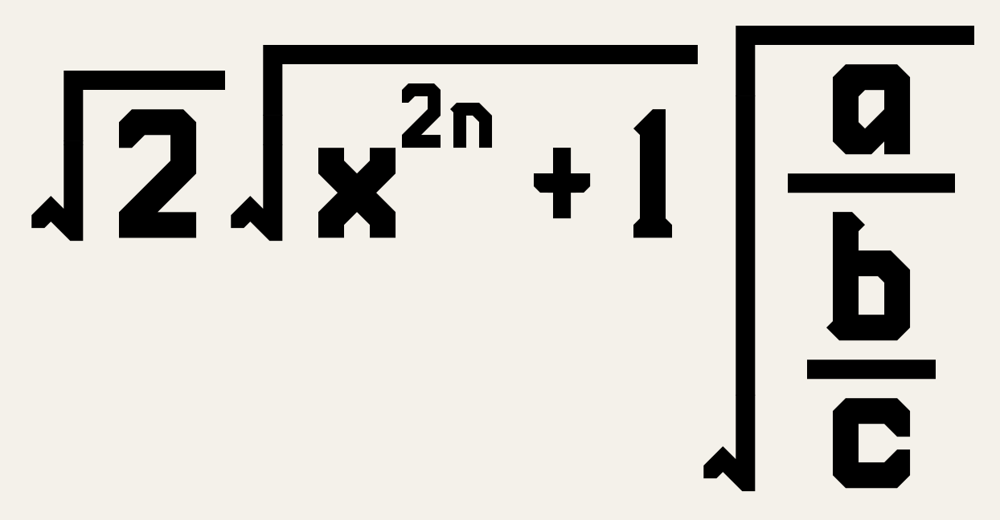
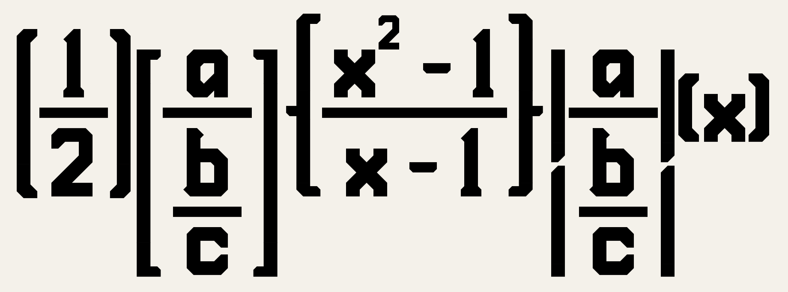
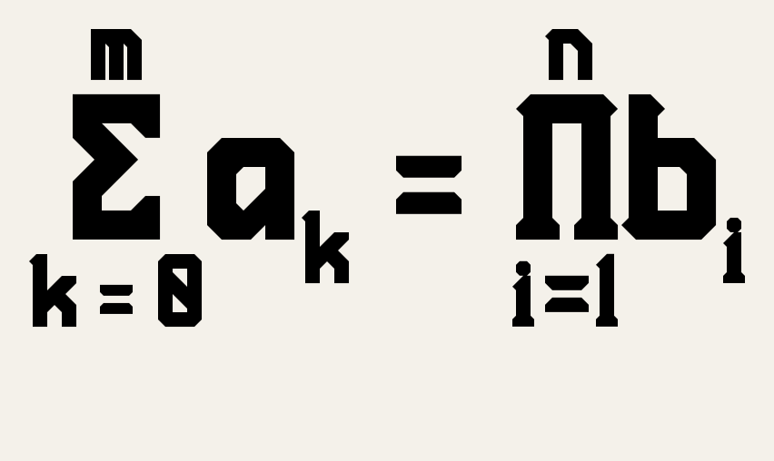
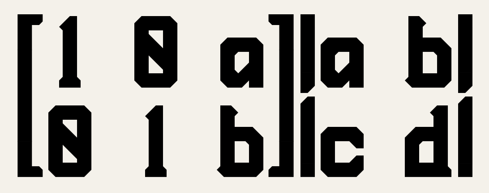
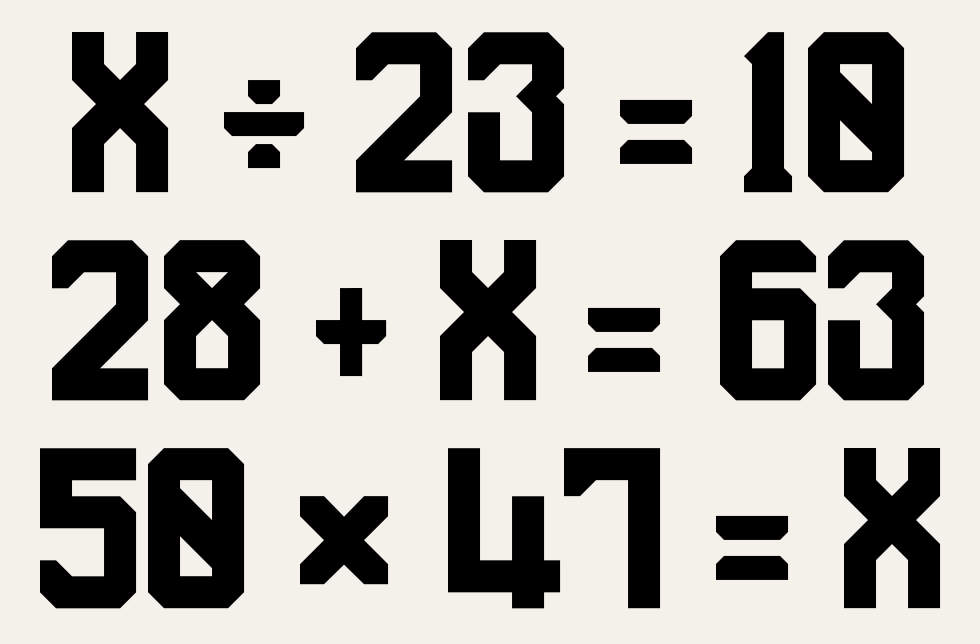

# PenchantManufacture ImagePipeline



**RadianN_kswg / ラジアン（柏木主税）による独自フォント PenchantManufacture** のグリフで、
分数・根号・可変高括弧・大型演算子の上下引数・行列・複数行といった**複数行にまたがる数式**を
**1 枚の画像**に組版する Bot／アプリ向けパイプラインです。

本家 [PenchantManufacture_ImageAssets](https://github.com/radiann-kswg/PenchantManufacture_ImageAssets)
をサブモジュール `basis/` として取り込み、**`basis/` のフォント実メトリクスとアウトラインだけ**を
入力にします（デカール PNG は使いません）。1 行で完結する技術表記はカスタム絵文字（本家）、
2 行以上の組版は本リポジトリ、という責務分界です（[AGENTS.md](AGENTS.md)）。

> **著作権者**: RadianN_kswg / ラジアン（柏木主税）
> **ライセンス**: [CC BY 4.0](https://creativecommons.org/licenses/by/4.0/deed.ja)
> 生成画像には PNG tEXt / SVG `<desc>` としてクレジットを埋め込みます。

---

## セットアップ

```bash
git submodule update --init --recursive     # basis/ を取得
pip install -r requirements.txt             # 依存は本家と同一（-r basis/requirements.txt）
python tests/test_typeset.py                # セルフチェック
```

Python 3.11+ / fontTools / cairosvg / Pillow / numpy / scipy / click。

## 使い方

```bash
python scripts/typeset.py "X \div 23 = 10" -o out.png --bg white
python scripts/typeset.py "\frac{a+b}{2} = x^2 + y_1 \\ \sqrt{x^{2n}+1}" -o out.png --cell 4
python scripts/typeset.py "\left[ \matrix{a & b \\ c & d} \right]" -o out.svg
python scripts/build_previews.py            # README 用プレビューを再生成
```

| オプション | 既定 | 意味 |
| --- | --- | --- |
| `-o PATH` | 必須 | 出力先。拡張子 `.svg` なら SVG、それ以外は PNG |
| `--cell N` | 3 | 1 セル（16.5 units）あたりの px。3 → cap height 120px、4 → 160px |
| `--bg COLOR` | 透過 | 背景色 |
| `--color COLOR` | `#000000` | 字色 |
| `--font PATH` | `basis/assets/fonts/PenchantManufacture.otf` | フォント差し替え |

Python からは `from typeset import Font, render, to_png`:

```python
font = Font()
svg = render(r"\frac{1}{2}", font, cell=3, bg="white")   # SVG 文字列
png = to_png(svg)                                          # PNG バイト列（クレジット付き）
```

---

## 対応する記法

TeX 風の最小サブセットです。空白は無視され、二項演算子・関係子の前後には自動で空きが入ります。

| 記法 | 意味 | プレビュー |
| --- | --- | --- |
| `x^2` `x_i` `x^{2n}` | 上付き・下付き。⁰–⁹ ⁿ ⁱ ⁺⁻⁼⁽⁾ / ₀–₉ ₙ ₊₋₌₍₎ は**フォント収録の実グリフに置換**、無い字は 50% 縮小して実グリフと同じ帯（上付き 28–48 セル／下付き −12–8 セル）に置く |  |
| `\frac{a}{b}` | 分数。バーは hyphen のステム幅（6 セル）、位置は数式軸（17 セル）。入れ子可 |  |
| `\sqrt{x}` | 根号。`√` の縦画を延長片で伸ばし、上線をステム幅で引く（線幅不変） |  |
| `\left( … \right)` | 可変高括弧 `( ) [ ] { } \|`。上端／下端（`{ } \|` は中央意匠も）に分割し延長片で補完（線幅不変） |  |
| `\limits{Σ}{i=1}{n}` | 大型演算子の上下引数。上引数は下付き字・下引数は上付き字で組む（本家 FUTURE_PLAN §3-3 の規則） |  |
| `\matrix{a & b \\ c & d}` | 行列（`&` 列・`\\` 行）。`\left[ … \right]` と組み合わせる |  |
| `a \\ b` | 複数行（中央揃え） |  |
| `\times \div \pm \mp \cdot \leq \geq \neq \approx \equiv \infty \partial \nabla \in \notin \cup \cap \land \lor \forall \exists \propto \therefore \because \ldots` `\alpha`…`\omega` `\Alpha`…`\Omega` `\,` | 記号・ギリシャ・細空き | — |

`\sum \prod \int` は本家 OTF の C2 大型演算子収録待ち（[docs/HANDOFF_PLAN.md](docs/HANDOFF_PLAN.md)）。
それまでは `\limits{Σ}{…}{…}` のようにギリシャ大文字を渡してください。

---

## 組版の原則

詳細は [docs/TYPESET_SPEC.md](docs/TYPESET_SPEC.md)。

1. **入力は `basis/` の実メトリクスのみ。** advance・GPOS カーニング・インク境界・アウトラインを
   `PenchantManufacture.otf` から読む。デカール PNG（`basis/dist/`）は素材にしない。
2. **縦位置はフォントのまま。** ベースラインを組版側で動かさない。
3. **設計グリッドに量子化。** 字面は 28×40 セル（1 セル = 16.5 units、cap height = 40 セル、
   ステム = 6 セル）で設計されているため、間隔・段組み・延長片・行列列幅・余白をすべてセル整数倍にし、
   `--cell N` で出力するとセル境界が整数 px に落ちる。行内の字はインク左端がセル境界に乗る。
4. **拡大縮小は上付き／下付きの代替のみ（50%）。** 括弧・根号は伸縮ではなく**分割＋延長片**で高さを作り、
   ステム 6 セルの意匠を崩さない。
5. **フォントに無い図形は最小限。** 分数バー・根号の上線・延長片だけを描き、線幅は hyphen のステム幅
   （分数バー）または分割位置のインク断面（延長片）から実測する。
6. **クレジットを保持。** 出力に `RadianN_kswg / ラジアン（柏木主税） / CC BY 4.0` を埋め込む。

---

## ディレクトリ構成

```
PenchantManufacture_ImagePipeline/
├── AGENTS.md                  ← エージェント共通指示（SSOT）
├── CLAUDE.md                  ← @AGENTS.md
├── README.md                  ← 本書
├── requirements.txt           ← -r basis/requirements.txt
├── basis/                     ← 【サブモジュール】本家（読み取り専用）
├── scripts/
│   ├── typeset.py             ← 組版本体（解析 → レイアウト → SVG/PNG）。CLI 兼ライブラリ
│   └── build_previews.py      ← docs/previews/ の再生成
├── tests/test_typeset.py      ← セルフチェック
└── docs/
    ├── TYPESET_SPEC.md        ← 組版仕様（グリッド・各構造の配置規則）
    ├── HANDOFF_PLAN.md        ← 引継ぎ資料（未対応・本家連動タスク）
    └── previews/*.png         ← README 掲載画像（build_previews.py が生成）
```

## 現状の制約

- `∑ ∏ ∫ ∮ …`（C2 大型演算子 15 字）は本家 OTF 収録待ち。収録後は変更なしで `\sum` 等が使える。
- 下付き小文字（ᵢ ₖ 等）はフォントに無いため 50% 縮小の代替になる（ステムは 3 セル相当）。
- デカール質感（`basis/scripts/generate_decal.py`）は未適用。平塗り出力のみ。
- 複数行の `&` 揃え（`=` 位置の整列）・行列の括弧自動付与・Bot／API 層は未実装。

以上は [docs/HANDOFF_PLAN.md](docs/HANDOFF_PLAN.md) にタスクとして整理しています。
